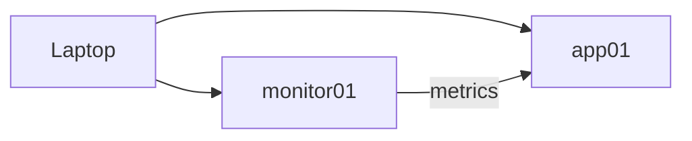

# Architecture

```mermaid
flowchart LR
    laptop[Laptop] --> app01
    laptop --> monitor01
    monitor01 -- metrics --> app01
```

- VPC `10.0.0.0/16`, public subnet `10.0.1.0/24`
- app01 (t3.micro): Nginx
- monitor01 (t3.small): Prometheus, Grafana
- SSH and web ports open to my IP only
